# What the NFFT computes

## Why a nonequispaced transform

Fast Fourier transforms (FFTs) belong to the "10 algorithms with the greatest
influence on the development and practice of science and engineering in the
20th century". The classic algorithm computes the discrete Fourier transform

$$
f_j = \sum_{k=-\frac{N}{2}}^{\frac{N}{2}-1} \hat f_{k}\,
\mathrm{e}^{-2\pi\mathrm{i}\frac{kj}{N}},
\qquad j=-\frac{N}{2},\dots,\frac{N}{2}-1,
$$

for given complex coefficients $\hat f_k \in \mathbb{C}$. A divide and conquer
approach reduces the number of floating point operations from the
${\cal O}(N^2)$ of the straightforward computation to only
${\cal O}(N\log N)$. Together with publicly available efficient
implementations, the FFT has become of great importance in scientific
computing.

Two shortcomings of the traditional schemes are the need for equispaced
sampling and the restriction to the system of complex exponential functions.
The NFFT is a C subroutine library for computing the nonequispaced discrete
Fourier transform (NDFT) and its generalisations in one or more dimensions, of
arbitrary input size, and of complex data.

NFFT3 removes the first restriction with the NFFT. The generalisations remove
the second.

## Notation

Frequencies are collected in the multi-index set

$$
I_{\mathbf{N}} := \left\{ \mathbf{k}=\left(k_t\right)_{t=0,\dots,d-1}
\in\mathbb{Z}^d : -\frac{N_t}{2} \le k_t < \frac{N_t}{2},\;
t=0,\dots,d-1 \right\},
$$

with the multibandlimit $\mathbf{N}=\left(N_t\right)_{t=0,\dots,d-1}$, each
$N_t$ even. Given coefficients $\hat f_{\mathbf k} \in \mathbb{C}$ for
$\mathbf k \in I_{\mathbf N}$, the task is the fast evaluation of the
trigonometric polynomial

$$
f\left(\mathbf{x}\right) := \sum_{\mathbf{k}\in I_{\mathbf{N}}}
\hat f_{\mathbf{k}}\, \mathrm{e}^{-2\pi\mathrm{i}\,\mathbf{k}\mathbf{x}}
$$

at $M$ arbitrary nodes $\mathbf{x}_j$ of the $d$-dimensional torus, and of the
adjoint sums

$$
\hat h_{\mathbf{k}} := \sum_{j=0}^{M-1} f_j\,
\mathrm{e}^{+2\pi\mathrm{i}\,\mathbf{k}\mathbf{x}_j}.
$$

Evaluating either sum as written costs ${\cal O}(|I_{\mathbf{N}}|M)$
operations. That is what `nfft_trafo_direct` and `nfft_adjoint_direct` do, and
it is the reference the tests measure against.

## Generalisations

The generalisations of the NFFT are:

- [NNFFT](../transforms/nnfft.md), the fast Fourier transform nonequispaced in
  time and in frequency,
- [NFCT and NFST](../transforms/nfct.md), the nonequispaced fast cosine and
  sine transforms,
- [NSFFT](../transforms/nsfft.md), the nonequispaced sparse fast Fourier
  transform,
- [FPT](../transforms/fpt.md), the fast polynomial transform,
- [NFSFT](../transforms/nfsft.md), the nonequispaced fast spherical Fourier
  transform,
- [NFSOFT](../transforms/nfsoft.md), the nonequispaced fast Fourier transform
  on the rotation group $\mathrm{SO}(3)$.

The library also inverts the above transforms by iterative methods. The
[solver](../transforms/solver.md) module provides them.

## The approximation

`nfft_trafo` factors the transform matrix into three cheap factors:

$$
\mathbf{A} \approx \mathbf{B}\,\mathbf{F}\,\mathbf{D}.
$$

```mermaid
graph LR
  H["f&#770;&#8342;<br/>coefficients"] --> D["D<br/>deconvolve"]
  D --> F["F<br/>FFT of length n"]
  F --> B["B<br/>window, 2m+2 points"]
  B --> S["f&#11388;<br/>samples"]
```

**D, deconvolution.** Each coefficient is divided by the Fourier transform
$\hat\varphi$ of a window function and the result is zero-padded from length
$N_t$ to an oversampled length $n_t \ge N_t$. Diagonal, so
${\cal O}(|I_{\mathbf{N}}|)$.

**F, the FFT.** One ordinary FFT of total length $n_0 \cdots n_{d-1}$, done by
FFTW. ${\cal O}(n \log n)$.

**B, the window.** Each node picks up a weighted sum of the $2m+2$ nearest grid
values in every dimension, weighted by the window $\varphi$. Sparse, so
${\cal O}(M)$ with a constant of $(2m+2)^d$.

Together: ${\cal O}(n\log n + M)$ instead of ${\cal O}(|I_{\mathbf{N}}|M)$.
The adjoint runs the same three factors in the opposite order.

## The two parameters

The factorisation is exact only in the limit. Two parameters set the trade
between accuracy and work.

`m`
:   The **cut-off**. The window is truncated to $2m+2$ grid points per
    dimension. The error falls off fast in `m`, the work in the sparse factor
    grows as $(2m+2)^d$. The default depends on the window and on the
    precision. Ask the library you linked rather than guessing:
    `nfft_get_default_window_cut_off()` returns 8 for the Kaiser-Bessel window
    in double precision.

`sigma`
:   The **oversampling factor**, $n_t = \sigma_t N_t$. A larger $\sigma$ leaves
    the window more room and lowers the error, at the price of a longer FFT.
    `nfft_init` picks $n_t = 2\cdot 2^{\lceil \log_2 N_t \rceil}$, which gives
    $2 \le \sigma_t < 4$. `nfft_init_guru` lets you set `n` yourself.

Which window function is used is fixed when the library is compiled, by
`--with-window`. The choices are Kaiser-Bessel (the default), Gaussian,
B-spline and sinc power. `nfft_get_window_name` reports the one in the library
you linked.

The accuracy actually reached for each combination is measured by the test
suite and published in the
[accuracy report](../development/testing.md).

## Next

- [Get started](../getting-started/index.md), install and run a first transform.
- [Transforms](../transforms/index.md), the definition of every module.
- [Applications](../applications/index.md), programs that use the transforms.
- [API reference](../api/index.md), every public function.
- [FAQ](../reference/faq.md), answers to frequent questions.
