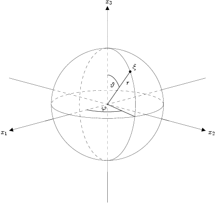

# NFSFT background

Definitions and properties that the [NFSFT](nfsft.md) uses: spherical
coordinates, Legendre polynomials, associated Legendre functions and spherical
harmonics.

## Spherical coordinates

Every point of $\mathbb{R}^3$ has spherical coordinates
$(r,\vartheta,\varphi)^{\mathrm{T}}$. The radius is $r \in \mathbb{R}^{+}$ and
the two angles are $\vartheta \in [0,\pi]$ and $\varphi \in [-\pi,\pi)$. The
two-dimensional unit sphere embedded in $\mathbb{R}^3$ is

$$
\mathbb{S}^2 := \left\{\mathbf{x} \in \mathbb{R}^{3} : \|\mathbf{x}\|_2 = 1
\right\}.
$$

A point of $\mathbb{S}^2$ is identified with the vector
$(\vartheta,\varphi)^{\mathrm{T}}$. The figure shows the coordinate system.

{ width="320" }

For consistency with the other modules the library uses **swapped scaled
spherical coordinates**

$$
x_1 := \frac{\varphi}{2\pi}, \qquad x_2 := \frac{\vartheta}{2\pi}.
$$

A point of $\mathbb{S}^2$ is then identified with the vector
$\mathbf{x} := (x_1,x_2) \in [-\tfrac{1}{2},\tfrac{1}{2}) \times
[0,\tfrac{1}{2}]$. The node array `plan.x` of an NFSFT plan stores $x_1$ and
$x_2$ of each node.

## Legendre polynomials

The Legendre polynomials $P_k : [-1,1] \rightarrow \mathbb{R}$,
$k \in \mathbb{N}_{0}$, are classical orthogonal polynomials. The Rodrigues
formula defines them:

$$
P_k(t) := \frac{1}{2^k k!}\,\frac{\mathrm{d}^k}{\mathrm{d} t^k}
\left(t^2-1\right)^k.
$$

They satisfy the three-term recurrence

$$
(k+1)P_{k+1}(t) = (2k+1)\,t\,P_{k}(t) - k\,P_{k-1}(t)
\qquad (k \in \mathbb{N}_0).
$$

Let

$$
\left< f,g \right>_{\mathrm{L}^2\left([-1,1]\right)} :=
\int_{-1}^{1} f(t)\, g(t)\, \mathrm{d} t
$$

be the usual $\mathrm{L}^2\left([-1,1]\right)$ inner product. The Legendre
polynomials obey the orthogonality condition

$$
\left< P_k,P_l \right>_{\mathrm{L}^2\left([-1,1]\right)} = \frac{2}{2k+1}
\,\delta_{k,l}.
$$

!!! note "Normalisation"

    The constant $c_k := \sqrt{\tfrac{2k+1}{2}}$ makes the scaled polynomials
    $c_k P_k$ orthonormal with respect to the induced norm

    $$
    \|f\|_{\mathrm{L}^2\left([-1,1]\right)} :=
    \left(\left<f,f\right>_{\mathrm{L}^2\left([-1,1]\right)}\right)^{1/2} =
    \left(\int_{-1}^{1} |f(t)|^2 \, \mathrm{d} t\right)^{1/2}.
    $$

## Associated Legendre functions

The associated Legendre functions
$P_k^n : [-1,1] \rightarrow \mathbb{R}$, $n \in \mathbb{N}_0$, $k \ge n$, are

$$
P_k^n(t) := \left(\frac{(k-n)!}{(k+n)!}\right)^{1/2}
\left(1-t^2\right)^{n/2}\,\frac{\mathrm{d}^n}{\mathrm{d} t^n} P_k(t).
$$

For $n = 0$ they coincide with the Legendre polynomials, $P_k^0 = P_k$. They
obey the three-term recurrence

$$
P_{k+1}^n(t) = v_{k}^n\, t\, P_k^n(t) + w_{k}^n\, P_{k-1}^n(t)
\qquad (k \ge n)
$$

with the start values $P_{n-1}^n(t) := 0$ and

$$
P_{n}^n(t) := \frac{\sqrt{(2n)!}}{2^n n!}\left(1-t^2\right)^{n/2},
$$

and the coefficients

$$
v_{k}^n := \frac{2k+1}{\left((k-n+1)(k+n+1)\right)^{1/2}}, \qquad
w_{k}^n := - \frac{\left((k-n)(k+n)\right)^{1/2}}
{\left((k-n+1)(k+n+1)\right)^{1/2}}.
$$

The [FPT](fpt.md) module uses this recurrence. For fixed $n$, the set
$\left\{P_k^n : k \ge n\right\}$ is a complete orthogonal system in
$\mathrm{L}^2\left([-1,1]\right)$ with

$$
\left< P_k^n,P_l^n \right>_{\mathrm{L}^2\left([-1,1]\right)} = \frac{2}{2k+1}
\,\delta_{k,l} \qquad (0 \le n \le k,l).
$$

!!! note "Normalisation"

    The constant $c_k = \sqrt{\tfrac{2k+1}{2}}$ makes the scaled functions
    $c_k P_k^n$ orthonormal with respect to the norm
    $\|\cdot\|_{\mathrm{L}^2\left([-1,1]\right)}$ defined above.

## Spherical harmonics

The standard orthogonal basis of $\mathrm{L}^2\left(\mathbb{S}^2\right)$
consists of the unnormalised spherical harmonics
$\tilde{Y}_k^n : \mathbb{S}^2 \rightarrow \mathbb{C}$,

$$
\tilde{Y}_k^n(\vartheta,\varphi) := P_k^{|n|}(\cos\vartheta)\,
\mathrm{e}^{\mathrm{i} n \varphi}.
$$

The usual $\mathrm{L}^2\left(\mathbb{S}^2\right)$ inner product is

$$
\left< f,g \right>_{\mathrm{L}^2\left(\mathbb{S}^2\right)} :=
\int_{\mathbb{S}^2} f(\vartheta,\varphi)\, \overline{g(\vartheta,\varphi)}
\, \mathrm{d} \boldsymbol{\xi} := \int_{-\pi}^{\pi} \int_{0}^{\pi}
f(\vartheta,\varphi)\, \overline{g(\vartheta,\varphi)} \sin \vartheta
\, \mathrm{d} \vartheta \, \mathrm{d} \varphi.
$$

The constant $c_k^n := \sqrt{\tfrac{2k+1}{4\pi}}$ gives the scaled basis
functions

$$
Y_k^n(\vartheta,\varphi) := c_k^n\, P_k^{|n|}(\cos\vartheta)\,
\mathrm{e}^{\mathrm{i} n \varphi}.
$$

They are orthonormal with respect to the induced norm

$$
\|f\|_{\mathrm{L}^2\left(\mathbb{S}^2\right)} =
\left(\left<f,f\right>_{\mathrm{L}^2\left(\mathbb{S}^2\right)}\right)^{1/2} =
\left(\int_{-\pi}^{\pi} \int_{0}^{\pi} |f(\vartheta,\varphi)|^2 \sin
\vartheta \, \mathrm{d} \vartheta \, \mathrm{d} \varphi\right)^{1/2}.
$$

A function $f \in \mathrm{L}^2\left(\mathbb{S}^2\right)$ has the orthogonal
expansion

$$
f = \sum_{k=0}^{\infty} \sum_{n=-k}^{k} \hat{f}(k,n)\, Y_k^n.
$$

The equality holds in the $\mathrm{L}^2$ sense. The coefficients
$\hat{f}(k,n) := \left< f, Y_k^{n} \right>_{\mathrm{L}^2\left(\mathbb{S}^2\right)}$
are the **spherical Fourier coefficients**.
